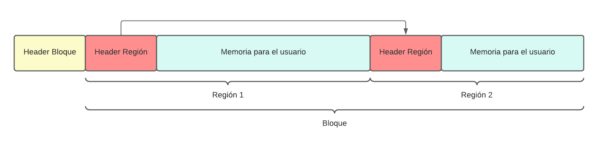

# malloc

Implementacion de funciones de memory allocation utilizando `mmap`.

---

## Compilar

```bash
$ make
```

## Compilar

```bash
$ make
``` 

## Compilar la librería

```bash
$ make libmalloc.so
```

## Ejecutar prueba (estática)

```bash
$ make run-s
```

## Ejecutar prueba (dinámica)

```bash
$ make run-d
```

## Linter

```bash
$ make format
```

---

# Informe

## Estructuras utilizadas

### Regiones (region_header_t)

En un comienzo, la implementación de malloc se pensó únicamente mediante regiones, las cuales eran almacenadas en un bloque de tamaño fijo. Estas regiones mencionadas, dentro de su estructura, contenían la siguiente información:
- *size* : Tamaño de la región.
- *free* : El estado de la región (Libre o no libre).
- *next* : Un puntero a la siguiente región.

En un principio, la idea de una lista simplemente enlazada para almacenar todas las regiones de un único bloque fue simple de implementar. Sin embargo, la idea de una lista simplemente enlazada comenzó a quedar deprecada por la gran complejidad computacional que tenían ciertas operaciones (por ejemplo, se tenía como primer approach de coalesce el recorrer toda la lista de regiones para juntarlas todas cada vez). Allí es donde surgió la idea de que la lista de regiones no sea mediante una lista simplemente enlazada, sino que con el objetivo de optimizar la implementación de malloc, la misma sea con una lista doblemente enlazada. 

Además de la lograr una gran optimización mediante el cambio de estilo de lista, se debieron agregar mas campos a la estructura un número especial de verificación que será explicado posteriormente a medida que se desarrollen los temas. Con todo lo explicado hasta el momento llegamos a una estructura de región conformada de la siguiente manera:
- *size* : Tamaño de la región.
- *free* : El estado de la región (Libre o no libre).
- *next* : Un puntero a la siguiente región.
- *prev* : Un puntero a la anterior región.
- *check_num* : Un número de verificación.

Cabe destacar que la estructura de región mencionada anteriormente se refiere al header que posee la región que luego se le brindará al usuario para que utilice.

### Bloques (block_header_t)

Siendo que la implementación de malloc debía soportar múltiples bloques, se decidió implementar una estructura que almacene toda la información de un bloque. Dado que para las regiones se vió un gran beneficio en la implementación de las listas doblemente enlazadas, en los bloques también se llevó a cabo la misma idea, quedando una estructura del siguiente estilo:
- next: Un puntero al siguiente bloque. 
- prev: Un puntero al anterior bloque. 
- size: Tamaño del bloque.

Siguiendo con la misma metodología que se implementó para las regiones, en donde las mismas tenían el header mecionado anteriormente, en los bloques se llevó a cabo la misma idea, un header previo al bloque en donde se almacenarán todas las regiones que podrá disponer el usuario. Cabe destacar que el tamaño del header del bloque no se encuentra incluido en el tamaño estandar que debía contener cada tipo de bloque, respetando así la consigna.

Para poder ejemplificar las estructuras utilizadas, a continuación se visualizará un diagrama con un ejemplo de las mismas:



Como podemos ver, la información del bloque se encuentra previa al header de la primera región. A su vez, toda la información de la región también era contenida previa a memoria que se brindaba al usuario. 

## Implementación

### Comentarios generales

Como se comentó en la explicación de las regiones, la implementación comenzó con un único bloque que contenía multiples regiones mediante la utilización de una lista simplemente enlazada. 

Este bloque que se le solicitaba al Sistema Operativo, en un principio se lo tomaba como una región completamente libre a la cual, dependiendo de la memoria que haya solicitado el usuario, se le realizaba un *split* y se la partía en dos regiones (una libre que quedaría disponible para una futura solicitud del usuario y una región ocupada). 

Esta idea de comenzar con una única región libre y realizarle un *split* se llevó también a cabo cuando se implementaron múltiples bloques.

### Split

El *split* de regiones se realizó de una manera muy sencilla y se intenta ejecutar todas las veces que fuera posible (se implementa en las funciones malloc, calloc y realloc, para evitar lo más posible la fragmentación interna). A modo de ejemplificación se citará un gráfico para poder explicar en qué casos es posible realizar el split de una región:


En el gráfico se observa una posible región a realizarle *split*.

Un split de regiones solo es realizable en caso de que la memoria inutilizada permita almacenar una nueva región, es decir, el mínimo tamaño del dicha memoria debe ser de `MIN_REGION_LEN` sumado al tamaño del header de una región (`sizeof(region_header_t)`, que en este caso es de 40 bytes). 

### Coalesce

El *coalesce* de regiones, al igual que el *split*, se realiza siempre que sea posible, pero esta vez evitando la fragmentación externa. 

Dado que el *coalesce* entre dos regiones libres no tiene mayor complejidad que generar un único header y aumentar el tamaño de la misma, se explicará en dónde fue realizado el *coalesce* y por qué no es necesario iterar sobre todas las regiones de todos los bloques en nuestra implementación (siempre se trata de un procedimiento con regiones adyacentes). 

Se aplica *coalesce* en nuestra implementación es en los siguientes escenarios:
- *free* : A la hora de liberar un bloque con free, siempre se intenta realizar un coalesce con las dos regiones vecinas (la anterior y la siguiente según implementación de lista doblemente enlazada), generando así que no haya posibilidad de que existan regiones contiguas libres. Aquí es donde se vé una gran ventaja de la utilización de listas doblemente enlazadas. Un detalle importante a remarcar es que en caso de que se realice un *coalesce* de todas las regiones de un bloque, y por lo tanto quede dicho bloque como libre, el mismo se retorna al Sistema Opertativo. 
- *realloc* : Para la optimización del realloc en donde se utilizan las regiones libres contiguas, es necesario realizar un *coalesce* para unir las mismas. De esta forma se termina de garantizar que en ninguna operacion se puede llegar a generar fragmentacion interna permanente.

### Malloc

Paso a paso simplificado:
1. Verificacón de parámetros para comportamientos especiales.
2. Búsqueda de una región libre. 
3. En caso de no encontrar una región libre, se crea una nueva region, lo cual implica la creación de un bloque. Como se mencionó anteriormente, un bloque se crea con una única región adentro.
4. Se configura la región para que aparezca como no libre.
5. Se le intenta relizar un *split*
6. Se retorna el puntero a la memoria que puede utilizar el usuario.

### Calloc

Paso a paso simplificado:
1. Verificacón de parámetros para comportamientos especiales.
2. Se realiza un llamado a malloc.
3. Se setea toda la memoria del usuario con ceros.
4. Se retorna el puntero a la memoria que puede utilizar el usuario.

### Realloc

Paso a paso simplificado:
1. Verificacón de parámetros para comportamientos especiales.
2. Se chequea que el puntero recibido sea válido (posteriormente se detallará cómo se verifica un puntero recibido).
3. Segun el nuevo tamaño de la región solicitada es que se acciona.
4. En caso de que el nuevo tamaño solicitado sea menor al actual y que la siguiente región se encuentre libre, se splitea la misma y se realiza un coalesce con la siguiente, sin necesidad de verificar ningún tamaño.
5. En caso de que el nuevo tamaño solicitado sea menor al actual y que la siguiente región no se encuentre libre, únicamente se intenta realizar un *split* de la región.
6. En caso de que el nuevo tamaño solicitado sea mayor al actual y la siguiente región sea válida (libre y con tamaño suficiente), se realiza un *coalesce* de ambas y un intento de *split*.
7. En caso de que el nuevo tamaño solicitado sea mayor al actual y únicamente la anterior región sea válida (libre y con tamaño suficiente), se realiza un *coalesce* de ambas y un intento de *split*. Cabe destacar que en este caso se realiza un traslado de memoria, dado que el *coalesce* se realiza con la región previa.
8. En caso de que el nuevo tamaño solicitado sea mayor al actual y la anterior y siguiente región sean válidas (libre y con tamaño suficiente), se realiza un *coalesce* de las tres y un intento de *split*. Cabe destacar que en este caso se realiza un traslado de memoria, dado que el *coalesce* se realiza con la región previa.
9. En caso de que no se cumpla el caso *6/7/8* se procede a realizar un `malloc` de dicho tamaño, se copia la memoria del usuario y se libera el puntero dado por el usuario.
10. Se retorna el puntero a la memoria que puede utilizar el usuario.

### Free

1. Se chequea que el puntero recibido sea válido (posteriormente se detallará cómo se verifica un puntero recibido).
2. Se libera la región dada y se intenta hacer *coalesce* con las regiones contiguas.
3. Se verifica si el bloque está completamente libre, y en caso de que esto se cumpla se lo retorna al Sistema Operativo.

### Verificacion de punteros recibidos

Para la verificación del puntero recibido en las funciones `realloc` y `free` se desarrolló una técnica que permite no recorrer todas las regiones de todos los bloques chequeando que el puntero recibido coincida con alguno de los mismos. 

Para esto se pensaron varias alternativas, de las cuales nos pareció que la mas óptima era primero verificar que la dirección del puntero se encuentre contenida en alguno de los bloques (esto ya nos protege frente a un acceso de memoria inválido). 

Ahora, para chequear que el puntero que nos enviaron corresponda al primer elemento de la mmeoria del usuario es que utilizamos dentro de la estructura de una región, un valor que contiene un número especial de verificación. Todas las regiones lo contienen y es un número aleatorio para justamente verificar que el puntero dado esté en la posición correcta y asi evitar accesos a memoria corrupta.

## Decisiones de diseño adicionales

### Estadisticas

Se definieron estadisticas para poder probar el funcionamiento de la libreria. La actualizacion y utilizacion de las estadisticas dentro de la lireria se define en tiempos de compilación. Si `USE_STATS` está definido a la hora compilar, la librería actualizará las estadisticas a medida que se vaya utilizando; si no lo está, no se compilará el codigo referente a las estadísticas. 

Estas estadisticas refieren tanto a cantidad de llamadas a las funciones, cantidad de memoria pedida y liberada, cantidad de regiones y bloques, cuantas veces realizo la operacion de coalesce y cuantas veces realizo la operacion de split. 

### Extra

*Tamaño minimo de una region* : Se decidio por 64 bytes.

*Magic number de 32 bits* : Número aleatorio utilizado para la verificación de memoria.

*Memoria máxima solicitada* : Se colocó como máximo de memoria de diez bloques grandes que puede utilizar un usuario a lo largo de la utilización de la libería malloc.s
