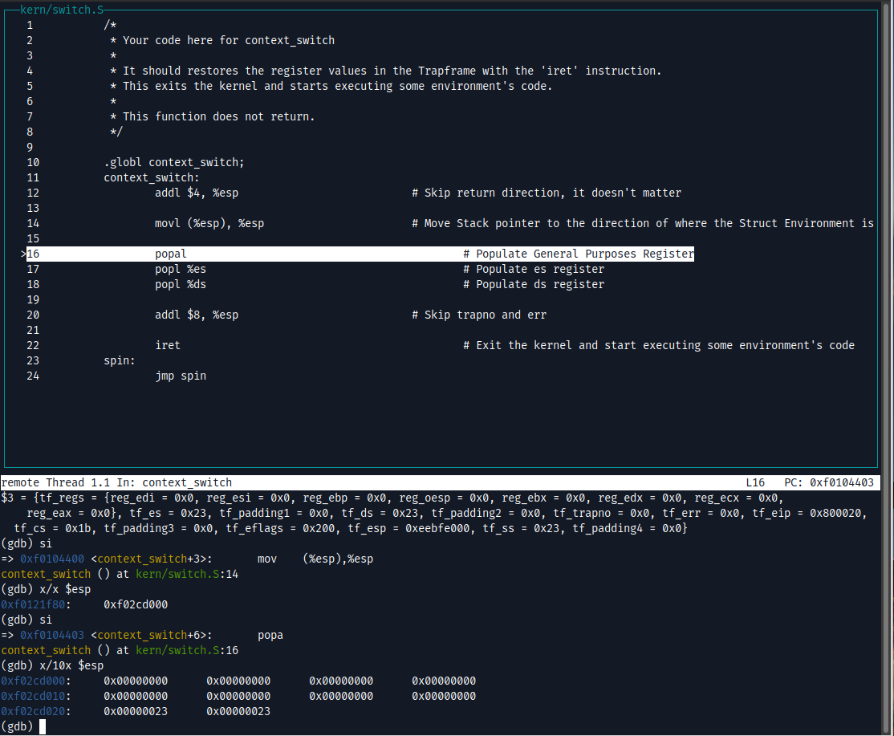

# sched.md

---

## Compilacion

Para correr con scheduler __Round Robin__

```bash
make SCHED=rr <comando>
```

Para correr con scheduler __MLFQ__

```bash
make SCHED=mlfq <comando>
```

En caso de faltar la flag, compilara por defecto con __MLFQ__. En caso de que la flag sea cualquier otra cosa, sera __Round Robin__.

---

## Context Switch

A continuacion mostramos el procedimiento de cambio de contexto por medio de GDB, pasando de kernel a un proceso de usuario.

- Se inicia añadiendo el breakpoint a la función env_run, y a continuacion se ejecutan las lineas hasta encontrarse previo a la ejecución del context switch:


- Luego entramos a la ejecución de context swith con un stepi:


- Revisamos los valores de los registros actualmente:


- De los anteriores se pueden destacar los valores de:
  - `esp`: Actualmente con la direccion de retorno que va a ser posteriormente skippeada
  - `eip`: Con la direccion actual de inicio de codigo del context switch
  - `cs:` Con valor `0x8` == `1000 (binario)` ; De donde con los ultimos dos bits se determina que actualmente nos encontramos en Ring 0.

- Ahora vemos el estado que tiene el stack pointer:


- Tambien observamos que el struct Trapframe se corresponde a los valores vistos almacenados en el stack como parametro para el context switch:


- Observamos ahora el estado del `esp` tras saltear la direccion de retorno y tras cargar el contenido del struct Trapframe a partir de su puntero:



- Posteriormente se cargan los registros de proposito general y los registros `es` y `ds`


- Se aumenta en 8 el `esp` para saltear los valores trapno y err:


- Se procede a ejecutar `iret`:


- Y ahora se observan los registros tras la ejecución. Notar que ahora estamos en el proceso de usuario. Notar que el valor del registro `cs` cambió a `0x1b` == `0001 1011 (bin)`; de donde los ultimos 2 bits representan que nos encontramos en Ring 3:


---

## Scheduler

### MLFQ

Para el scheduler con prioridades se decidio implementar MLFQ. Para esto se realizaron ciertos cambios en la estructuras del _environment_ y el comportamiento del `lAPIC`.

```c
struct Env {
 (...)
 int32_t queue_num;
 struct Env *next_env;
 int32_t time_remaining;
 int32_t time_in_queue;
};
```

`queue_num`: para el facil armado y manejo de la estructuras de las colas, cada _environment_ tiene un puntero a su proximo _environment_ dentro de la cola.

`queue_num`: refiere a la cola en la que se encuentra actualmente el _environment_. A menor numero de cola, mayor prioridad. (En otras palabras, la cola 0 es la que tiene mas prioridad)

`time_remaining`: es el tiempo que le queda al _environment_ para correr.

`time_in_queue`: es el tiempo que un determinado _enviroment_ utilizó para correr dentro de una cola.

__local APIC timer__

Se modificó el comportamiento, pasandolo de _periodic mode_, a _one-shot mode_, permitiendo así un control del tiempo más granular para cada _environment_ que se vaya a correr.

Las variables que se utilizan para 'modificar' los tiempos de esta implementación de MLFQ se encuentran en `inc/sched.h`.

- `NQUEUES` : Cantidad de colas dentro de MLFQ
- `MLFQ_BOOST_AMNT` : Cantidad de veces que se debe terminar el equivalente a un _time slice_ para realizar el boost de todos los _environments_ a la cola de mayor prioridad
- `MLFQ_BASE_TIMER` : Tiempo base de un _time slice_. El tiempo final puede ser, o no, modificado por la prioridad del _environment_ a correr.
- `MLFQ_MIN_THRESHOLD` : Cantidad de tiempo mínimo para que un _environment_ pueda correrse. Se toma para que luego del _context switch_ el proceso pueda realizar acciones.
- `MLFQ_MAX_TIME_IN_QUEUE` : Cantidad de tiempo hasta que un _environment_ baje de prioridad. Por decisión de diseño se definió que a mayor prioridad, se le otorga un menor time slice a los procesos. Esto decisión genera que los procesos que requieran más computo degraden su priodad rapidamente y por lo tanto mejore el tiempo de respuesta al usuario. 
- `MLFQ_BOOST` : Tiempo que determina cuándo se debe realizar un boost de todos los procesos hacia la cola con mayor prioridad.
- `CPU_TIME_HALT` : Tiempo para que una CPU se despierte luego de un `CPU_HALTED`.

### Estadísticas

Para las estadísticas se optó por realizar la siguiente estructura, la cual será impresa al final de cada ejecución del sistema operativo:

```c
typedef struct env_info {
	envid_t env_id;
	int32_t last_prio;
	int32_t curr_prio;
} env_info_t;

typedef struct sched_stats {
	size_t sched_calls;
	size_t boost_calls;

	env_info_t downgrade_calls[NDWN_CALLS];
	size_t num_downgrade_calls;
	size_t laps_num_downgrade_calls;

	env_info_t env_run_calls[NRUN_CALLS];
	size_t num_env_run_calls;
	size_t laps_env_run_calls;

} sched_stats_t;
```
`sched_calls`: representa las llamadas al scheduler.

`boost_calls`: representa la cantidad de veces que se realizó un boost de los _envirments_.

`downgrade_calls`: almacena la información de todos los _enviroments_ a los cuales se le realizó un _downgrade_.

`num_downgrade_calls`: almacena el index del último elemento del array _downgrade_calls_.

`laps_num_downgrade_calls`: cantidad de veces que se completó el array _downgrade_calls_.

`env_run_calls`: almacena la información de todos los _enviroments_ a los cuales se los mandó a correr.

`num_env_run_calls`: almacena el index del último elemento del array _env_run_calls_.

`laps_env_run_calls`: cantidad de veces que se completó el array _env_run_calls_.

### Diseño de implementación ROUND ROBIN

El Round Robin fue implementado de la misma manera que MLFQ, a diferencia que únicamente los procesos no eran degradados en cuanto cumplían una cierta cantidad de _time slide_.

---
