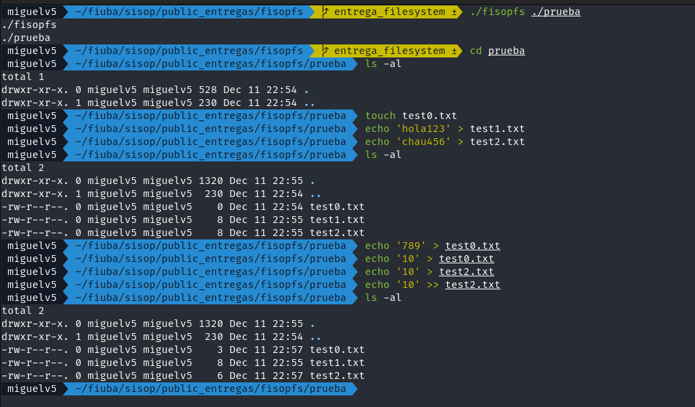
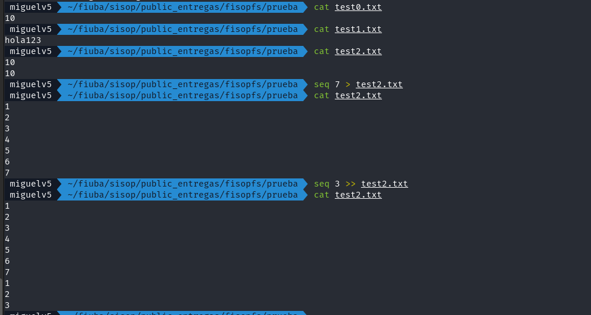
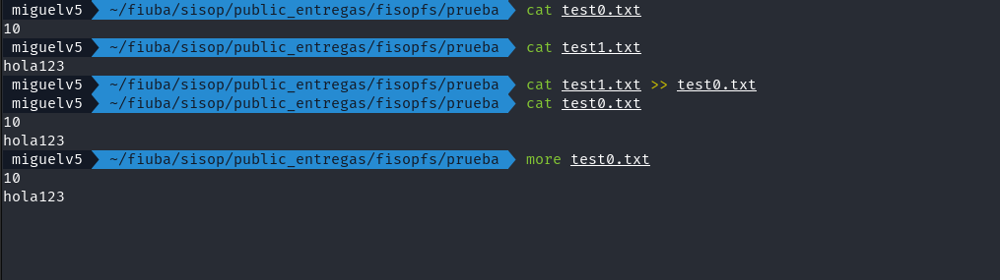
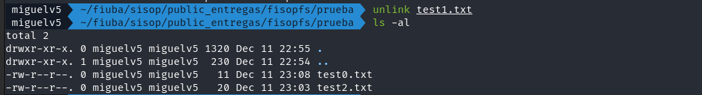
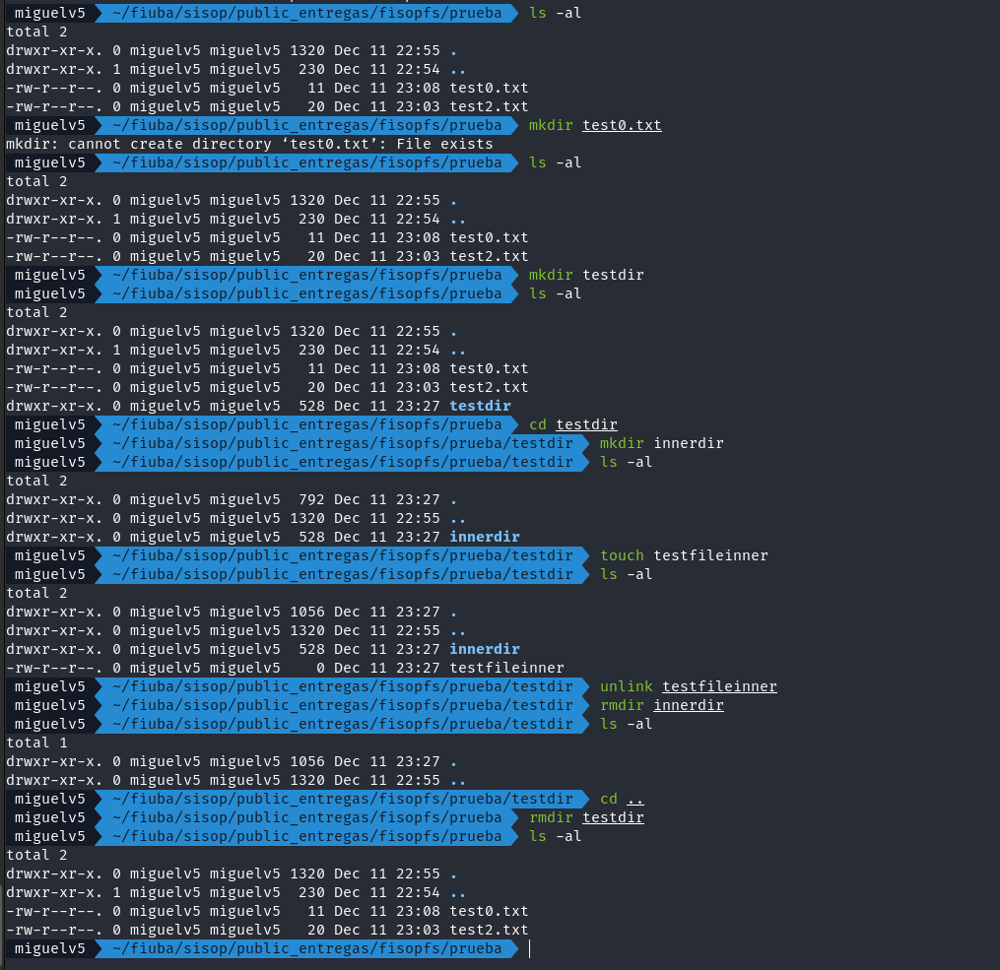
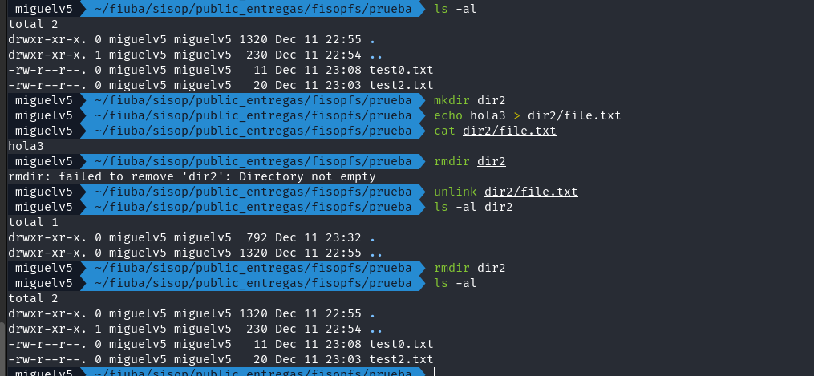
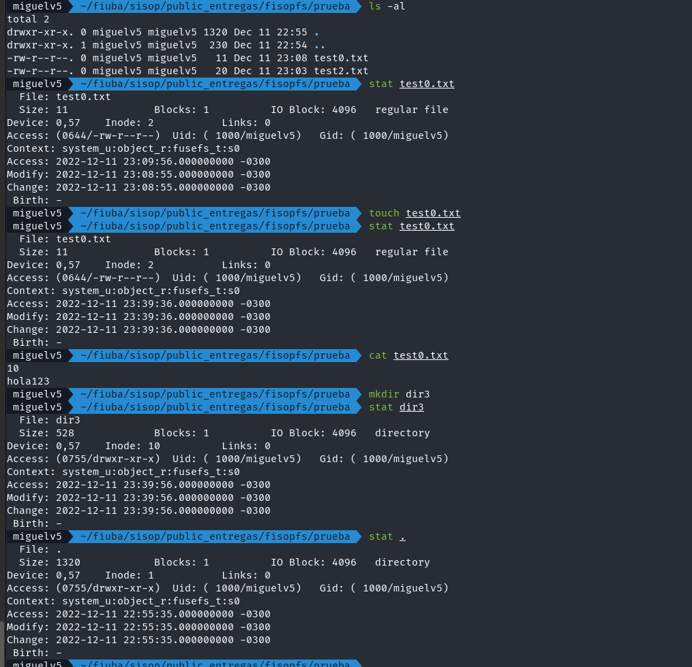

# fisopfs
Sistema de archivos tipo FUSE.

## Estructuras

```c
struct superblock {
	int inode_amount;
	int data_blocks_amount;
	int block_size;

	int inode_start;
	int data_start;

	ino_t root_inode;
};
```
El *superblock* contiene la informacion relevante del sistema de archivos, como la cantidad de bloques, el tamaño de los mismos, cantidad de inodos. Ademas contiene 'punteros' para saber donde empieza cada parte relevante del sistema de archivos. El inodo del root siempre sera algo que el *superblock* inicializara y sera constante durante el tiempo de vida del sistema de archivos 

```c
struct inode {
	mode_t type_mode;
	uid_t user_id;
	gid_t group_id;

	time_t last_access;
	time_t last_modification;
	time_t created_date;

	size_t size;
	nlink_t link_count;
	int blocks[MAX_INODE_BLOCK_PTR];
	blkcnt_t block_amount;
};
```
Un inodo contendra toda la informacion relevante de un archivo dentro del sistema. Aca se podra saber si se trata de un directorio o un archivo. Ademas se puede saber los permisos requeridos por el archivo y la informacion acerca del usuario creador y su grupo. Para esto se utilizo las *bitmask* provistas por `<sys/stat.h>`, que son las mismas usadas por FUSE para facilitar la traduccion. 

Las fechas relevantes se mantendran actualizadas segun la operacion de fuse que sera realizada. 

Se mantiene la cuenta de la cantidad de bloques que un inodo esta utilizando para albergar su informacion. En caso de que la cantidad de bloques sea mayor a la cantidad del array que contiene los 'punteros' a los mismos, se utilizara un nivel de indireccion para almacenar los 'punteros' a los bloques restantes. Este bloque 'extra' que utiliza el sistema de archivos, no se contara como un bloque esta utilizando el inodo. 

Se mantiene la cuenta de la cantidad de *links* que contiene un inodo para saber si al momento de *deslinkear* un inodo de un directorio, se tiene que eliminar. En esta instancia no estan implementados los links, por lo que siempre se dara un inodo como eliminado al primer llamado de unlink. 


```c
struct dentry {
	ino_t inode_number;
	char file_name[MAX_FILE_NAME];
};
```

Un inodo que tenga como tipo de archivo que es un directorio, la informacion que almacenara en los bloques sera un arreglo de `dentry`. Una dentry tendra el numero de inodo al que pertenece y el nombre del inodo dado por el usuario. En caso de que una dentry se encuentre vacia, tendra como numero de inodo el 0, el cual esta reservado para ese proposito. Todo directorio, tendra al menos los pseudo directorios '.' y '..'. 

## Serializacion

A fin de serializar el *filesystem*, primero se serializa el superbloque para almacenar la metadata general, seguido del bitmap de todos los `inodos`. Esto se hace, ya que los `inodos` se guardan ya sea si estan ocupados o no, a fin de mantener el numero de inodo al que apunta cada dentry consistente cuando se cargue denuevo el *filesystem*. Luego se serializara, el `inodo` **i**, guardando todo la estructura completa, y de forma adyacente, toda la informacion del usuario que apunta ese `inodo`. De esta forma, al cargar denuevo el sistema de archivos desde un archivo, se puede asegurar que la informacion del usuario se encuentra completa, en el `inodo` en el que se estaba usando al momento de serializar. No se garantiza que los numeros de los bloques usados para albergar la informacion del usuario sean los mismos.


## Busqueda de archivos dado un path

Para la busqueda de archivos y directorios se tienen varias funciones auxiliares. En especifico la más relevante es `search_inode`, la cual realiza ciertas verificaciones/parseo del path para posteriormente: 
1. Obtener el inodo root
2. Realizar una busqueda recursiva por cada *token* encontrado en el path hasta hallar el inodo del ultimo nombre encontrado (con token hacemos referencia a un nombre individual de archivo o directorio. Por ejemplo para `/foo/bar/spam/eggs` la busqueda finalizaria por encontrar el inodo de `eggs`)

Cabe mencionar a `iterate_over_dir` como una de las funciones auxiliares más utilizadas, la cual dado un inodo correspondiente a un directorio, recorre todas sus direntries aplicando una función dada por parametro (`dentry_iterator_func`) 

## Ejecuciones de prueba junto con salidas esperadas

Para la revisión de funcionamiento de funcionalidades se probó la ejecución de las siguientes secuencias de comandos en bash:
- Creación de archivos (`touch`, redirección de escritura, redirección de escritura en modo append), lectura de archivos (con cat, more, less), Escritura de archivos (sobre-escritura y append con redirecciones):
    
    
    

- Borrado de un archivo (con `rm` o `unlink`):
    
    

- Creación de directorios (con `mkdir`), lectura de directorios, incluyendo los pseudo-directorios . y .. (con `ls -al`), borrado de un directorio (con `rmdir`), la creación de directorios soporta al menos un nivel de recursión:
    
    - (`rmdir` no permite si el dir tiene contenidos):
    

- Acceder a las estadísticas de los archivos (con stat):
    


